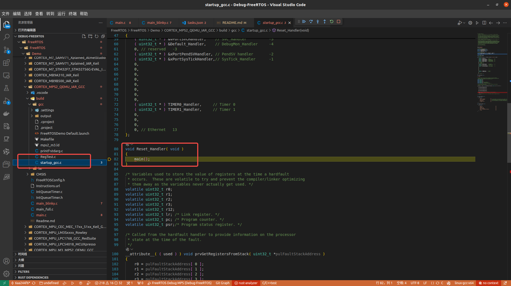

# Debug-FreeRTOS

# QEMU 调试 FreeRTOS
[Debug-FreeRTOS 1](https://www.freertos.org/zh-cn-cmn-s/Documentation/02-Kernel/03-Supported-devices/04-Demos/03-Emulation-and-simulation/QEMU/Install-and-start-QEMU-emulator)
[Debug-FreeRTOS 2](https://www.freertos.org/zh-cn-cmn-s/Documentation/02-Kernel/03-Supported-devices/04-Demos/03-Emulation-and-simulation/QEMU/freertos-on-qemu-mps2-an385-model)


# 编译固件
执行``` qemu.sh```,生成调试文件 ```FreeRTOS/FreeRTOS/Demo/CORTEX_MPS2_QEMU_IAR_GCC/build/gcc/output/RTOSDemo.out```

# 调试
点击 VsCode 的调试按钮，停止到Reset_Handler函数。然后就可以愉快的进行调试了。
